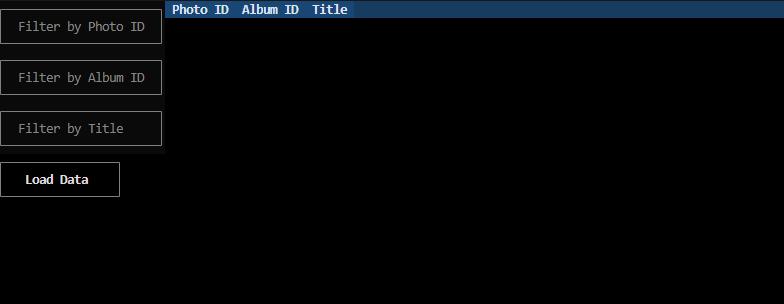

# Lean TECHniques Technical Showcase - Matt Hutchison
An application displaying photo album information for the purpose of demonstrating technical qualifications to the review team. It is a console application using the `textual` package to create a more comfortable experience interacting with the data.

## Before you get started
The application requires either that Docker is installed or a local installation of Python (3.9 or greater). Clone the repository from GitHub and proceed to the instructions for either [Docker](#running-with-docker) or [local Python](#running-with-local-python)

## Running with Docker
If GNU `make` and Docker are installed, the simplest way to run the application is `make run` from this directory. If `make` is not present, the container can be built and run using `docker build -t leantechniques-demo . && docker run -it --rm leantechniques-demo`.

## Running with local Python
It is possible to run the application without Docker if you have a current installation of Python (3.9 or greater). A virtual environment (venv or conda) is highly recommended if you take this approach. To use:
- Activate the desired virtual environment
- Install the requirements found in requirements.txt (generally `pip install -r requirements.txt`)
- Run the application with `python3 main.py`

## Example
Once the application is running in the terminal you should see an interface like the screenshot below. Navigation is either by mouse or keyboard (tab between fields, enter to submit) and once filters are set the Load Data button will submit the service request.

## Development
Automated tests can be run using `make test`, which will build the latest docker image and execute the test suite. Tests can also be run on a local Python installation using `python3 -m unittest`.